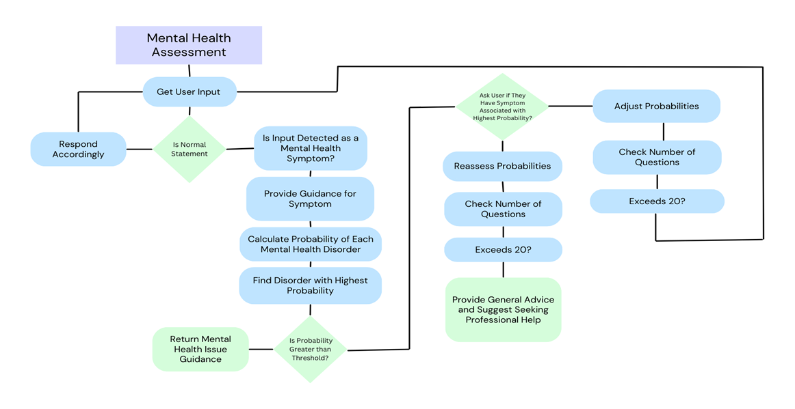

## SETUP STEPS:

## Setting Up a Python Virtual Environment and Django Project with MySQL

Step 1: Navigate to Your Project Directory
Open your terminal or command prompt and navigate to your project folder:
cd /path/to/your/project

Step 2: Create a Virtual Environment
Create a virtual environment named env using the following command:
python -m venv env
This will create a folder named env that contains your isolated virtual environment.

Step 3: Activate the Virtual Environment
To activate the environment, use the following command:
- Windows:
  env\Scripts\activate
- macOS/Linux:
  source env/bin/activate
You should now see (env) at the start of your command prompt, indicating that your virtual environment is active.

Step 4: Install Dependencies
While the virtual environment is active, you can install all the required packages from a requirements.txt file using:
pip install -r requirements.txt

Step 5: Deactivate the Environment
Once you're done working, you can deactivate the environment by typing:
deactivate

## Setting Up the Django Project with MySQL

1. Place Your Project Folder in the Virtual Environment
   Copy or move your Django project folder into the newly created virtual environment folder if it's not already there.

2. Configure the SQL Connection
   Open the settings.py file located inside your project folder. Find the DATABASES section and modify it with your MySQL username and password:

   DATABASES = {
       'default': {
           'ENGINE': 'django.db.backends.mysql',
           'NAME': 'health_care',     # Your MySQL database name
           'USER': 'your_username',   # Your MySQL username
           'PASSWORD': 'your_password', # Your MySQL password
           'HOST': 'localhost',       # Database host
           'PORT': '3306',            # Default MySQL port
       }
   }
  
3. Create the Database in MySQL
   Open MySQL Workbench or any other MySQL interface and create the health_care database using the following SQL command:
   CREATE DATABASE health_care;
   Press Ctrl + Enter to execute the command, and then refresh the database list to confirm it was created.

4. Apply Migrations
   Once the database is set up, go back to your terminal and run the following commands to apply migrations:
   python manage.py makemigrations
   python manage.py migrate
   These commands will create the necessary tables in the health_care database.

6. Run the Development Server
   Once everything is set up and the data is loaded, you can start the Django development server by running:
   python manage.py runserver

   This will launch your website, and you can access it by navigating to http://127.0.0.1:8000 in your browser.

## Files to be added from drive before running

Add the files from this drive link "https://drive.google.com/drive/folders/1wVXaG2JHL0eCLDwXX06QEEyHrPEjXK7F?usp=sharing" to hacktolearn\disease
Add the files from this drive link "https://drive.google.com/drive/folders/1Zd_9JOV7rGKTaBzsS9R5IKay6Iihom_c?usp=sharing" to hacktolearn\mental_health
Add the files from this drive link "https://drive.google.com/drive/folders/1-H2Tuq_WEnYWZvZnwmrNbzUN9IlPP9Mm?usp=sharing" to hacktolearn\CancerDiagnoser

## Requirements :
absl-py==2.1.0
asgiref==3.8.1
astunparse==1.6.3
certifi==2024.7.4
charset-normalizer==3.3.2
click==8.1.7
colorama==0.4.6
Django==5.1
Faker==28.0.0
flatbuffers==24.3.25
gast==0.6.0
google-pasta==0.2.0
grpcio==1.66.0
h5py==3.11.0
idna==3.8
joblib==1.4.2
keras==3.5.0
libclang==18.1.1
Markdown==3.7
markdown-it-py==3.0.0
MarkupSafe==2.1.5
mdurl==0.1.2
ml-dtypes==0.4.0
mysqlclient==2.2.4
namex==0.0.8
nltk==3.9.1
numpy==1.26.4
opencv-python==4.10.0.84
opt-einsum==3.3.0
optree==0.12.1
packaging==24.1
pandas==2.2.2
pillow==11.0.0
protobuf==4.25.4
Pygments==2.18.0
python-dateutil==2.9.0.post0
pytz==2024.1
regex==2024.7.24
requests==2.32.3
rich==13.7.1
scikit-learn==1.5.1
scipy==1.14.1
setuptools==73.0.1
six==1.16.0
sqlparse==0.5.1
tensorboard==2.17.1
tensorboard-data-server==0.7.2
tensorflow==2.17.0
tensorflow-intel==2.17.0
termcolor==2.4.0
threadpoolctl==3.5.0
tqdm==4.66.5
typing_extensions==4.12.2
tzdata==2024.1
urllib3==2.2.2
Werkzeug==3.0.4
wheel==0.44.0
wrapt==1.16.0

## Abstract

The MedTech Innovation Alliance aims to address diagnostic gaps in healthcare through an AI-driven platform. By leveraging machine learning and predictive tools, the project seeks to enhance diagnostic accuracy, improve patient care management, provide mental health support, and offer emergency health services. This project aligns with the UN Sustainable Development Goals (SDG 3: Good Health and Well-being and SDG 9: Industry Innovation and Infrastructure).

## FLowchart:

overview of the project: 
flow of the disease diagnoser:
flow of the mental health chatbot: 